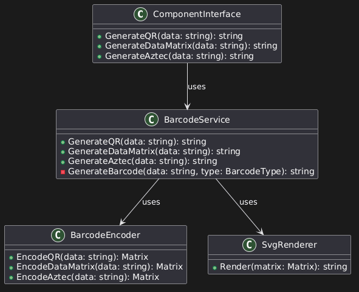

<div align="center">

# SVG Barcode Generator for 1C

**Native C++ external component for 1C:Enterprise  
for generating 2D barcodes in clean SVG format**

<br>


<br>
<br>

<a href="#overview">Overview</a>
&nbsp;•&nbsp;
<a href="#features">Features</a>
&nbsp;•&nbsp;
<a href="#architecture">Architecture</a>
&nbsp;•&nbsp;
<a href="#building">Building</a>
&nbsp;•&nbsp;
<a href="#testing">Testing</a>
&nbsp;•&nbsp;
<a href="#documentation">Documentation</a>

</div>

---

## Overview

**SVG Barcode Generator for 1C** is a cross-platform native C++ external component for **1C:Enterprise**.

It generates 2D barcodes and returns them as **SVG markup**, making the result suitable for:

- printed forms;
- reports;
- documents;
- labels;
- web pages;
- scalable UI rendering.

The project uses [ZXing-cpp](https://github.com/zxing-cpp/zxing-cpp) for barcode encoding and converts the generated barcode matrix into SVG.

---

## Features

<table>
  <tr>
    <td><b>QR Code</b></td>
    <td>Generate QR codes as SVG</td>
  </tr>
  <tr>
    <td><b>DataMatrix</b></td>
    <td>Generate DataMatrix codes as SVG</td>
  </tr>
  <tr>
    <td><b>Aztec</b></td>
    <td>Generate Aztec barcodes as SVG</td>
  </tr>
  <tr>
    <td><b>1C Integration</b></td>
    <td>Native external component API integration</td>
  </tr>
  <tr>
    <td><b>Cross-platform</b></td>
    <td>Windows, Linux, and macOS builds</td>
  </tr>
  <tr>
    <td><b>Modern C++</b></td>
    <td>C++20, modular architecture, CMake build system</td>
  </tr>
</table>

---

## Supported Barcode Types

| Barcode type | Status | Output |
|---|---:|---|
| QR Code | Supported | SVG |
| DataMatrix | Supported | SVG |
| Aztec | Supported | SVG |

---

## Why SVG?

SVG output is useful because it is:

- scalable without quality loss;
- easy to embed into HTML;
- suitable for printing;
- lightweight;
- independent from raster image formats;
- easy to store as plain text.

---

## Repository Structure

```text
include/        Public headers, interfaces, and declarations
src/            Component implementation and core logic
external/       Third-party libraries: ZXing-cpp and 1C Native API SDK
docs/           Project documentation, architecture notes, and UML diagrams
tests/          Unit tests for encoders, services, factories, and renderers
```

---

## Architecture

The project follows a layered architecture where barcode encoding, rendering, service logic, and 1C integration are separated into independent modules.

| Layer | Component | Responsibility |
|---|---|---|
| Encoder interface | `IEncoder` | Common contract for all barcode encoders |
| Encoders | `QREncoder`, `DataMatrixEncoder`, `AztecEncoder` | Barcode-specific encoding logic |
| Factory | `EncoderFactory` | Creates an encoder for the requested barcode type |
| Service | `BarcodeService` | Main API for generating barcode SVG output |
| Rendering | `SvgRenderer` | Converts barcode matrices into SVG markup |
| 1C integration | `ComponentInterface` | Bridges C++ logic with the 1C external component API |

<div align="center">



<br>

<i>UML class diagram</i>

</div>

---

## Requirements

### Common Requirements

- CMake 3.20+
- C++20-compatible compiler
- ZXing-cpp
- 1C Native API SDK

### Supported Compilers

| Platform | Compiler |
|---|---|
| Windows | MSVC, MinGW-w64, Clang |
| Linux | GCC, Clang |
| macOS | Apple Clang |

---

## Building

### Clone the Repository

```bash
git clone https://github.com/Triler1/1c-barcode-generator.git
cd 1c-barcode-generator
```

Make sure all third-party dependencies in `external/` are available before building.

---

<details>
<summary><b>Windows build</b></summary>

<br>

### Windows x86

The 1C:Enterprise client on Windows is commonly used as a 32-bit application.  
When targeting a 32-bit 1C client, build the component as **x86**.

### Visual Studio 2022

```bat
cmake -B build -S . -G "Visual Studio 17 2022" -A Win32
cmake --build build --config Release
```

Result:

```text
build/Release/BarcodeGenerator.dll
```

### MinGW-w64

```bat
cmake -B build -S . -G "MinGW Makefiles" ^
  -DCMAKE_C_COMPILER=i686-w64-mingw32-gcc ^
  -DCMAKE_CXX_COMPILER=i686-w64-mingw32-g++

cmake --build build
```

Result:

```text
build/BarcodeGenerator.dll
```

</details>

---

<details>
<summary><b>macOS build</b></summary>

<br>

The 1C:Enterprise client for macOS is commonly built for `x86_64`.  
On Apple Silicon, it may run through Rosetta, so build the component for `x86_64` unless your target 1C client requires another architecture.

### Install Dependencies

```bash
xcode-select --install
brew install cmake
```

### Build

```bash
cmake -B build -S . -DCMAKE_OSX_ARCHITECTURES=x86_64
cmake --build build
```

Result:

```text
build/libBarcodeGenerator.dylib
```

</details>

---

<details>
<summary><b>Linux build</b></summary>

<br>

### Install Dependencies

```bash
sudo apt update
sudo apt install cmake g++ ninja-build
```

### Build

```bash
cmake -B build -S .
cmake --build build
```

Result:

```text
build/libBarcodeGenerator.so
```

</details>

---

## Build Artifacts

| Platform | Library |
|---|---|
| Windows | `BarcodeGenerator.dll` |
| Linux | `libBarcodeGenerator.so` |
| macOS | `libBarcodeGenerator.dylib` |

---

## Usage from 1C

After building the native library, it can be loaded in 1C as an external component.

### Load the Component

```bsl
ПутьКомпоненты = "C:\Path\To\BarcodeGenerator.dll";

Подключено = ПодключитьВнешнююКомпоненту(
    ПутьКомпоненты,
    "BarcodeGenerator",
    ТипВнешнейКомпоненты.Native
);

Если Не Подключено Тогда
    ВызватьИсключение "Failed to load BarcodeGenerator component";
КонецЕсли;

Генератор = Новый("AddIn.BarcodeGenerator.BarcodeGenerator");
```

For Linux and macOS, use the corresponding shared library:

```bsl
// Linux
ПутьКомпоненты = "/path/to/libBarcodeGenerator.so";

// macOS
ПутьКомпоненты = "/path/to/libBarcodeGenerator.dylib";
```

---

### Generate QR Code

```bsl
Данные = "https://example.com";
РазмерМодуля = 10;
Отступ = 4;

SVG = Генератор.GenerateQR(
    Данные,
    РазмерМодуля,
    Отступ
);
```

---

### Generate DataMatrix

```bsl
Данные = "010460123456789021ABC123";
РазмерМодуля = 10;
Отступ = 4;

SVG = Генератор.GenerateDataMatrix(
    Данные,
    РазмерМодуля,
    Отступ
);
```

---

### Generate Aztec

```bsl
Данные = "AZTEC-123456";
РазмерМодуля = 10;
Отступ = 4;

SVG = Генератор.GenerateAztec(
    Данные,
    РазмерМодуля,
    Отступ
);
```

---

### Save SVG to File

```bsl
ПутьФайла = "C:\Temp\barcode.svg";

Запись = Новый ЗаписьТекста;
Запись.Открыть(ПутьФайла, КодировкаТекста.UTF8);
Запись.Записать(SVG);
Запись.Закрыть();

Сообщить("SVG barcode saved to: " + ПутьФайла);
```

---

### Method Parameters

| Parameter | Type | Description |
|---|---|---|
| `data` | String | Text or payload to encode |
| `moduleSize` | Number | Size of one barcode module in SVG units |
| `margin` | Number | Quiet zone around the barcode |

Example:

```bsl
SVG = Генератор.GenerateDataMatrix("1234567890", 8, 2);
```

---

### Available Methods

| Method | Description |
|---|---|
| `GenerateQR(data, moduleSize, margin)` | Generates QR Code SVG |
| `GenerateDataMatrix(data, moduleSize, margin)` | Generates DataMatrix SVG |
| `GenerateAztec(data, moduleSize, margin)` | Generates Aztec SVG |

---

### Russian Method Aliases

The component also provides Russian aliases for barcode generation methods.

You can use either English method names:

```bsl
SVG = Генератор.GenerateQR("Hello", 10, 4);
SVG = Генератор.GenerateDataMatrix("1234567890", 10, 4);
SVG = Генератор.GenerateAztec("AZTEC-123", 10, 4);
```

or Russian aliases:

```bsl
SVG = Генератор.СформироватьQR("Hello", 10, 4);
SVG = Генератор.СформироватьДатаМатрикс("1234567890", 10, 4);
SVG = Генератор.СформироватьAztec("AZTEC-123", 10, 4);
```

| English method | Russian alias | Description |
|---|---|---|
| `GenerateQR` | `СформироватьQR` | Generates QR Code SVG |
| `GenerateDataMatrix` | `СформироватьДатаМатрикс` | Generates DataMatrix SVG |
| `GenerateAztec` | `СформироватьAztec` | Generates Aztec SVG |

Both English method names and Russian aliases accept the same parameters:

```text
data, moduleSize, margin
```

---

### Notes

- The returned value is an SVG string.
- SVG can be saved to a file, embedded into HTML, or used in generated documents.
- For initial testing, use digits or Latin characters.
- Full Unicode handling depends on string conversion between 1C and the native component.

---

## Testing

Unit tests are located in the `tests/` directory.

The test suite covers:

- QR encoder;
- DataMatrix encoder;
- Aztec encoder;
- encoder factory;
- barcode service;
- SVG renderer;
- barcode matrix behavior.

---

## Documentation

Project documentation, architecture notes, implementation details, and UML diagrams are located in the `docs/` directory.

| Document | Description |
|---|---|
| [Project Documentation](docs/README.md) | Main documentation entry point |
| [Architecture](docs/architecture.md) | Architecture overview |
| [Implementation Plan](docs/implementation-plan.md) | Development plan and implementation notes |
| [UML Class Diagram](docs/uml-class-diagram.png) | Visual class diagram |

---

## External Libraries

| Library | Purpose | License |
|---|---|---|
| [ZXing-cpp](https://github.com/zxing-cpp/zxing-cpp) | Barcode encoding | Apache License 2.0 |
| 1C Native API SDK | 1C external component integration | See SDK license |

---

## Project Status

The project is under active development.

Current focus:

- stable barcode generation core;
- 1C external component integration;
- SVG rendering;
- cross-platform builds;
- unit test coverage.

---

## Roadmap

Planned improvements:

- more advanced 1C usage examples;
- improved Unicode handling;
- more complete platform-specific build documentation;
- CI builds for Windows, Linux, and macOS;
- expanded test coverage;
- example generated SVG previews;
- release packages for each supported platform.

---

## License

This project is licensed under the **Apache License 2.0**.

See the [LICENSE](LICENSE) file for details.

---

## Third-Party Licenses

- [ZXing-cpp](https://github.com/zxing-cpp/zxing-cpp) — Apache License 2.0  
  See [licenses/LICENSE.zxing-cpp](licenses/LICENSE.zxing-cpp).

---

<div align="center">

Made for 1C:Enterprise barcode generation in clean SVG format.

</div>
